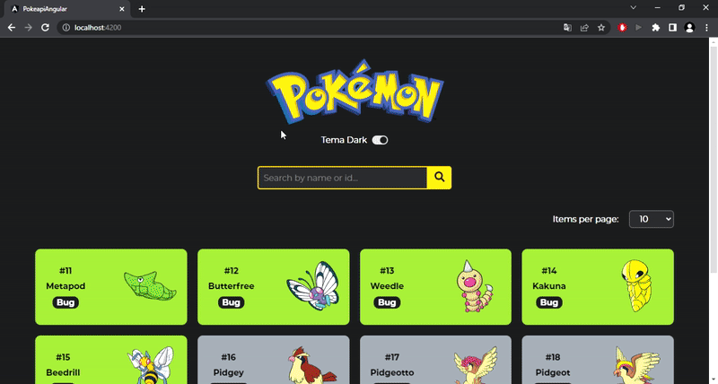

# PokeapiAngular



### [Acessar a demonstração](https://pokeapi-angular-lucasluan01.vercel.app/)

## 💻 Sobre o projeto

Site responsivo, construído a partir da API de Pokemóns que contém informações de todos os pokemóns. No site é possível escolher a quantidade de pokemóns exibidos por página, escolher entre os temas claro e escuro e pesquisar um pokemón pelo nome ou id.

## 🛠 Tecnologias

As seguintes ferramentas foram usadas na construção do projeto:

- [Angular](https://angular.io/)
- [TypeScript](https://www.typescriptlang.org/)

## 🧭 Rodando a aplicação

```bash
# Clone este repositório
$ git clone https://github.com/lucasluan01/pokeapi-angular

# Acesse a pasta do projeto no terminal/cmd
$ cd pokeapi-angular

# Instale as dependências
$ npm install

# Execute a aplicação em modo de desenvolvimento
$ ng serve --o

# O servidor inciará na porta:4200 - acesse <http://localhost:4200/>

#O aplicativo será recarregado automaticamente se você alterar qualquer um dos arquivos de origem.
```

## Autor

Desenvolvido por Lucas Luan 💻 [Entre em contato!](https://www.linkedin.com/in/lucas-luan-dos-santos/)
